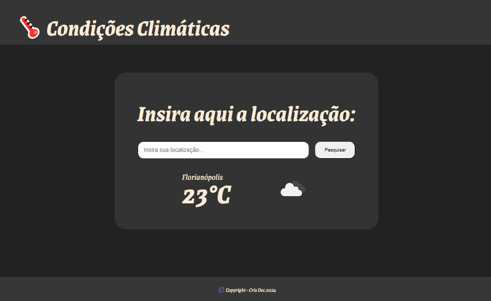

# Projeto TS: Condições Climáticas

A proposta desse projeto foi criar uma aplicação web para obter dados meteorológicos da "Open Weather API".

## 🎮 Tecnologias utilizadas:

  - HTML
  - CSS
  - TypeScript
  - Git e GitHub

### 💌 Agradecimentos

"Gratidão à todos os envolvidos nesse curso, Santander, Ada Tech e Let's Code que dedicaram seu tempo para formação de novos profissionais."
Então... bora codar!! 
